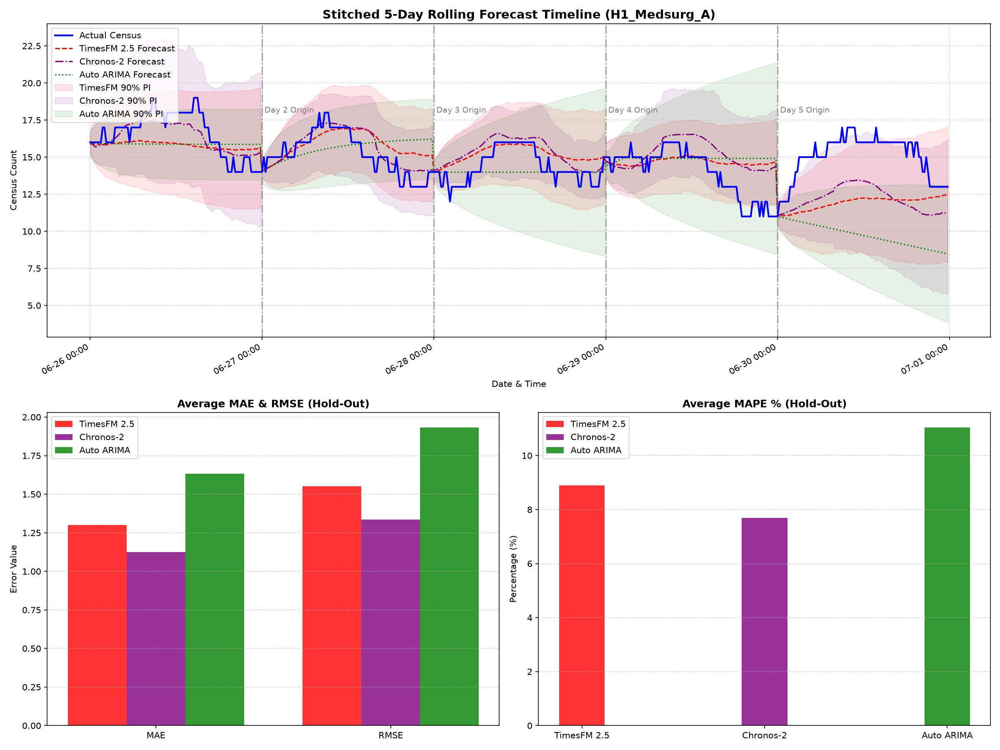
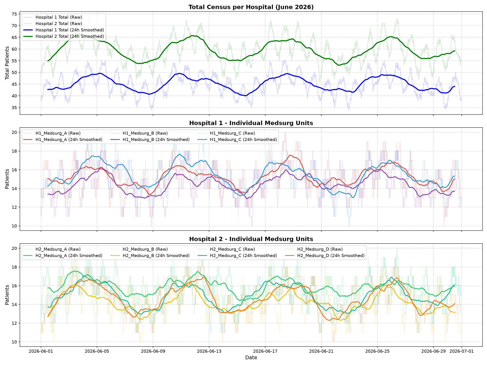

# Hospital Census Forecasting: Google TimesFM 2.5 vs. Auto ARIMA

This repository contains a performance comparison between **Google's TimesFM 2.5 (200M parameter PyTorch Foundation Model)** and a traditional **Auto ARIMA** statistical model. Both models are evaluated on a simulated 15-minute interval multi-hospital census dataset.

---

## 📊 Overview & Methodology

Hospital census forecasting is crucial for daily staffing, resource allocation, and operational planning. This project compares two contrasting methodologies:
1. **TimesFM 2.5**: A zero-shot foundation model pre-trained on massive time-series corpuses. It requires **no training/fitting** on local data and supports batch inference.
2. **Auto ARIMA**: A classical statistical model from `pmdarima` that fits parameters ($p, d, q$) locally and sequentially for each individual time series.

---

## 📈 Performance Summary (Strict Hold-Out Set)

The models were evaluated using a rolling 24-hour day-ahead forecast (96 steps) over a strict **5-day hold-out dataset** (June 26 to June 30, 2026) across 7 unit series.

### 1. Accuracy (Averaged over 7 units and 5 days)

| Metric | Google TimesFM 2.5 | Auto ARIMA | Performance Gain (TimesFM) |
| :--- | :---: | :---: | :---: |
| **MAE** (Mean Absolute Error) | **1.2999** | 1.6333 | **20.4% error reduction** |
| **RMSE** (Root Mean Squared Error) | **1.5508** | 1.9330 | **19.8% error reduction** |
| **MAPE** (Mean Absolute Percentage Error) | **8.89%** | 11.04% | **19.5% error reduction** |

### 2. Computational Profile & Speeds

| Profile Area | Google TimesFM 2.5 | Auto ARIMA | Comparison Details |
| :--- | :---: | :---: | :--- |
| **Training / Fitting** | **None** (Zero-Shot) | Fits parameters per window | TimesFM does not require any local training, eliminating MLOps retraining pipelines. |
| **Inference Mode** | **Batch Processing** | Sequential Processing | TimesFM forecasts all 7 series in parallel. ARIMA must run sequentially. |
| **Time per Window (7 series)** | **~1.40s** total (~0.20s/series) | **~7.0s** total (~1.0s/series) | **TimesFM is ~5.0x faster** in throughput. |

---

## 🔍 Visual Results

### Stitched 5-Day Forward Test Comparison
The plot below illustrates the daily rolling forecasts stitched together over the 5-day hold-out period for the representative unit `H1_Medsurg_A`:



*The top panel shows the actual census (blue) vs. TimesFM 2.5 (red dashed) and Auto ARIMA (green dotted). Vertical line indicators show the rolling daily forecast origins. Bottom panels show aggregate errors.*

### Hospital Census Profiles
The month-long 15-minute interval dataset exhibits clear daily admissions/discharges cycles and weekly staffing trends:



---

## 📁 Repository Structure

* `generate_hospital_data.py`: Creates `hospital_census.csv` with simulated 15-minute census values (bounded between 10 and 20) showing daily/weekly hospital admission behaviors.
* `plot_hospital_data.py`: Computes hospital census totals and saves the 3-panel profile plot (`hospital_census_plot.png`).
* `backtest_comparison.py`: Runs walk-forward sliding window backtesting over the development split.
* `forward_test.py`: Partitions dataset and runs the formal forward-testing daily forecast loop over the hold-out set, generating `forward_test_comparison.png` and `forward_test_summary.md`.
* `test_timesfm.py`: Simple smoke test script to verify TimesFM package and downloads weights from Hugging Face.
* `requirements.txt`: Package dependencies (`timesfm`, `pmdarima`, `pandas`, `matplotlib`).

---

## 🚀 Getting Started

### 1. Installation
Ensure you have Python 3.10+ (compatible up to Python 3.14). Create a virtual environment and install the dependencies:

```powershell
python -m venv .venv
.venv\Scripts\activate
pip install -r requirements.txt
```

### 2. Generate Dataset & Plot Profiles
```powershell
python generate_hospital_data.py
python plot_hospital_data.py
```

### 3. Run Sliding Window Backtesting
```powershell
python backtest_comparison.py
```

### 4. Run Strict Hold-Out Forward Testing
```powershell
python forward_test.py
```
