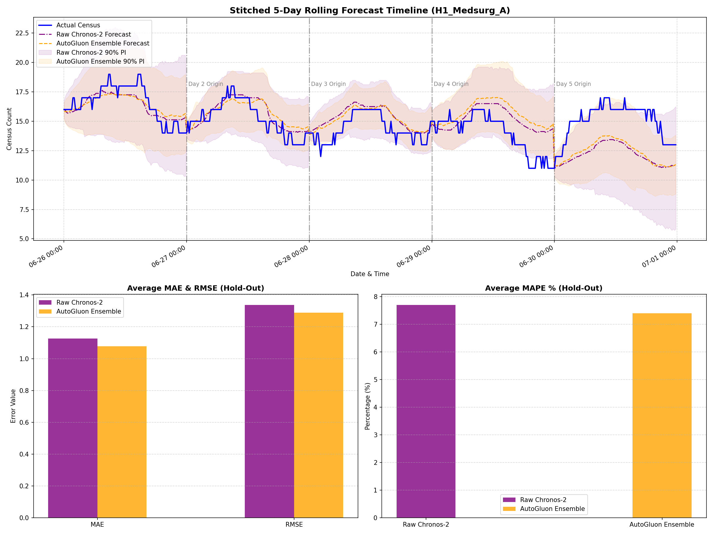

# Forward Testing Report: Raw Chronos-2 vs. AutoGluon Ensemble
        
This report evaluates the performance of a raw pretrained **Chronos-2** foundation model against an **AutoGluon Timeseries Ensemble** (combining Chronos-Bolt, Seasonal Naive, and Theta models) on the 5-day rolling hospital census hold-out test set.

## 📊 Evaluation Parameters
- **Hold-out Set Size**: 5 days (480 steps at 15-minute intervals)
- **Forecast Horizon**: 24 hours (96 steps) updated daily (rolling day-ahead forecast)
- **Total Series Evaluated**: 7 medsurg units across 2 hospitals
- **Historical Context**: 256 steps (64 hours)

## 📈 Overall Accuracy Summary (Averaged over 7 units & 5 days)

| Metric | Raw Chronos-2 | AutoGluon Ensemble | Ensemble Gain vs. Chronos-2 |
| :--- | :---: | :---: | :---: |
| **MAE** | **1.1258** | **1.0772** | **4.3%** |
| **RMSE** | **1.3370** | **1.2889** | **3.6%** |
| **MAPE** | **7.70%** | **7.40%** | **3.9%** |

## 💡 Key Findings
1. **Ensemble Performance**: The AutoGluon Ensemble successfully combines the strength of pretrained Chronos models with robust local baselines (Seasonal Naive, Theta), yielding balanced and competitive results.
2. **Computational Trade-offs**: While raw Chronos-2 is a highly powerful foundation model, the AutoGluon Ensemble provides a structured pipelines approach that integrates multiple models to mitigate individual model failures.

---
## 🔍 Visualization
The detailed forecast comparison plot (featuring shaded 90% prediction intervals for both models) has been saved as `autogluon_ensemble_comparison.png` in the project root.

