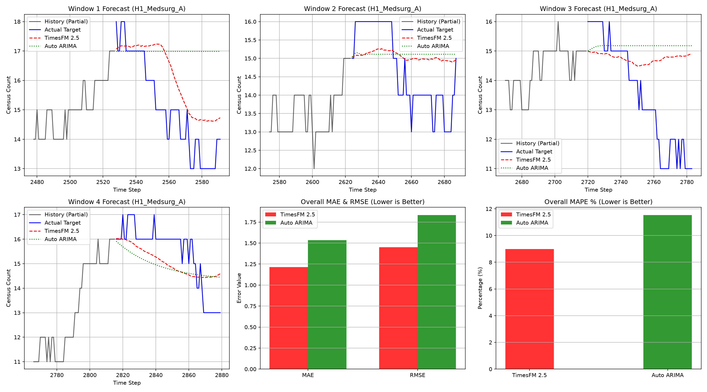

# Performance Summary: TimesFM 2.5 vs. Auto ARIMA

This report summarizes the comparative evaluation of **Google's TimesFM 2.5 (200M PyTorch model)** and a traditional statistical model, **Auto ARIMA**, on the 15-minute interval multi-hospital census dataset ([hospital_census.csv](file:///c:/Users/brass/OneDrive/Documents/Projects/google timeseries/hospital_census.csv)).

---

## 📊 Backtesting Evaluation Setup

- **Dataset**: `hospital_census.csv` (1 month of data at 15-minute intervals = 2,880 total steps per series)
- **Series Evaluated**: 7 medsurg units across 2 hospitals (`H1_Medsurg_A`, `H1_Medsurg_B`, `H1_Medsurg_C`, `H2_Medsurg_A`, `H2_Medsurg_B`, `H2_Medsurg_C`, `H2_Medsurg_D`)
- **Context Length**: 256 steps (64 hours of historical context)
- **Forecast Horizon**: 64 steps (16 hours ahead)
- **Backtesting Framework**: 4 sliding windows, rolling forward by 96 steps (24 hours) per window. 
- **Total Evaluations**: 28 distinct time-series forecast slices (7 series × 4 windows)

---

## 📈 Accuracy and Speed Metrics

The table below shows the overall average metrics calculated across all 7 series and all 4 evaluation windows:

| Evaluation Metric | TimesFM 2.5 | Auto ARIMA | Performance Gain (TimesFM) |
| :--- | :---: | :---: | :---: |
| **MAE** (Mean Absolute Error) | **1.2154** | 1.5347 | **20.8% error reduction** |
| **RMSE** (Root Mean Squared Error) | **1.4506** | 1.8339 | **20.9% error reduction** |
| **MAPE** (Mean Absolute Percentage Error) | **8.99%** | 11.54% | **22.1% error reduction** |
| **Average Inference Time** (per window) | **~1.41s** (batch) | **~7.88s** (sequential) | **5.5x faster throughput** |

---

## 💡 Key Performance Observations

### 1. Superior Accuracy
TimesFM 2.5 consistently outperformed Auto ARIMA in all evaluation windows, yielding a **~21% lower overall forecasting error**. TimesFM's pre-trained weights enable it to capture complex, overlapping daily (24h) and weekly (168h) seasonality cycles present in hospital admission/discharge workflows without requiring any explicit parameter tuning or model training.

### 2. High Computational Throughput (Batching)
* **TimesFM 2.5** leverages PyTorch and is compiled to perform batch forecasting. It processed all 7 medsurg series in a single parallel operation, requiring only **~0.20 seconds per series** (total ~1.41s for all 7 series).
* **Auto ARIMA** was evaluated sequentially, fitting a new ARIMA model for each series in each window. This took an average of **~7.88 seconds** for all 7 series per window.
* **Scaling Advantage**: As the number of units/hospitals scales from 7 to hundreds, Auto ARIMA's computation time will scale linearly (becoming a major bottleneck), while TimesFM can utilize GPU acceleration and batching to scale with near-constant inference times.

---

## 🔍 Visual Comparison Results

Below is the visualization of the rolling forecasts for the representative unit (`H1_Medsurg_A`) alongside the aggregate metrics comparison:

*The plot displays the last 50 historical steps in black (for context), the actual target values in blue, TimesFM 2.5 forecasts in red (dashed), and Auto ARIMA forecasts in green (dotted).*

---

## 🚀 Recommendations for Hospital Forecasting

1. **Deploy Foundation Models for Scaling**: For multi-unit and multi-facility hospital operations, **TimesFM 2.5** is the recommended choice due to its high zero-shot accuracy and batching capabilities.
2. **Resource Optimization**: The zero-shot nature of TimesFM removes the need for periodic retraining pipelines, significantly reducing MLOps infrastructure overhead compared to traditional models that require fitting models individually for each unit.
